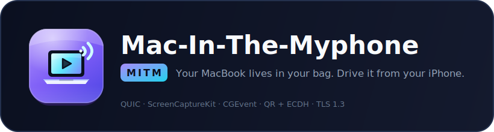
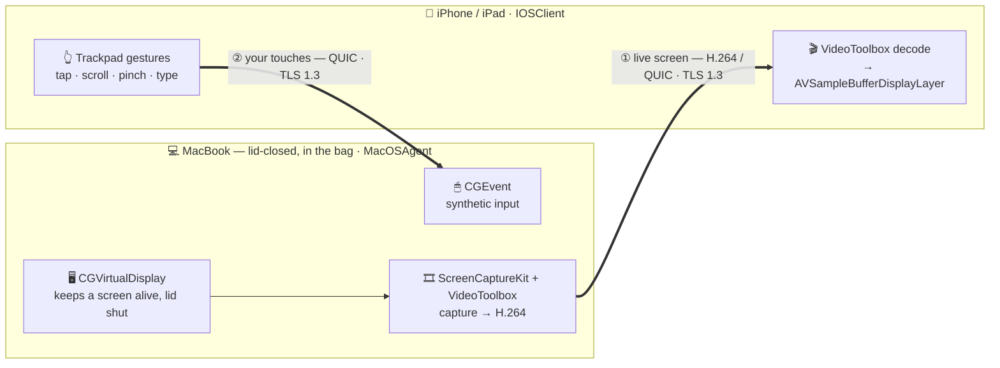

<div align="center">



### Your MacBook lives in your bag. Drive it from your iPhone.

*Stream and control a **lid-closed, bag-stowed MacBook** from an iPhone or iPad —
over your phone's hotspot, low-latency, while you're on the move.*

<br/>

[](README.md)
[](README_KO.md)

[](https://github.com/jjw0-0/Mac-In-The-Myphone/actions/workflows/ci.yml)
[](LICENSE)
[](Package.swift)
[](#-build)

<br/>

<a href="https://github.com/jjw0-0/Mac-In-The-Myphone/stargazers">
  
</a>

<sub><i>↑ if this idea speaks to you, drop a star — it's how a pre-alpha finds its people</i></sub>

</div>

---

> [!WARNING]
> **Pre-alpha.** The architecture is decided and the foundation builds & tests green, but the
> end-to-end pipeline is still being assembled. Watch/Star to follow along — it's cultivated commit by commit.

## Why the name?

**M**ac-**I**n-**T**he-**M**yphone. The wink at *Man-In-The-Middle* is the whole point: the only thing
allowed between your phone and your Mac is **you**. Pairing is bootstrapped **out-of-band** through a
QR code carrying an ECDH public-key fingerprint, and every byte rides **TLS 1.3** with downgrade
refused — so an actual man-in-the-middle walks away with nothing.

## Table of Contents

- [The story](#the-story)
- [Features](#-features)
- [Architecture](#-architecture)
- [Security & honest limitations](#-security--honest-limitations)
- [Build](#-build)
- [Project status](#-project-status)
- [Roadmap](#-roadmap)
- [Contributing](#-contributing)
- [License](#-license)

## The story

You're on the subway. Your MacBook is asleep in your bag. You pull out your iPhone — and there's
your full desktop. Mail, documents, the desktop-only apps mobile can't replace — responsive under
your thumb, one-handed, on a moving train.

Commercial RDP/VNC assumes desktop-to-desktop sessions on stable Wi-Fi. **MITM** is built for the
opposite: a phone-provided hotspot, a Mac kept awake inside a closed bag, and touch-first
interaction designed for movement.

## ✨ Features

| | |
|---|---|
| 📺 **Live screen** | ScreenCaptureKit + VideoToolbox, H.264 low-latency (H.265 promoted only on a clean link) |
| 👆 **Full control** | Trackpad-style cursor, tap-to-click, two-finger scroll, pinch-zoom, text input |
| 🔒 **Secure by design** | QR + ECDH pairing, TLS 1.3, per-session input re-handshake, replay-proof channel |
| 🎒 **Survives the bag** | Keeps a capture surface alive lid-closed via a virtual display, with thermal guardrails |
| 📡 **Built for the move** | QUIC path migration rides hotspot ↔ cellular handoffs without dropping the session |
| 🔁 **Self-healing** | Auto-reconnect with session recovery; adaptive bitrate degrades gracefully, never flaps |

## 🏗 Architecture

**One Swift package, three targets.** `MacOSAgent` captures and serves the screen; `IOSClient` decodes it and sends your touches back; **`SharedCore`** is the contract both obey — wire protocol, binary codecs, coordinate mapping, the connection state machine. Each end depends only on `SharedCore`, never on the other.



<div align="center"><sub><b>①</b> video streams Mac → phone &nbsp;·&nbsp; <b>②</b> input flows phone → Mac &nbsp;·&nbsp; both ride <b>one</b> encrypted QUIC / TLS 1.3 session</sub></div>

### Key decisions

| Layer | Decision |
|---|---|
| **Transport** | QUIC (`Network.framework`) + Bonjour discovery + IP-hint fallback + path migration |
| **Video** | ScreenCaptureKit + VideoToolbox · H.264 default, H.265 one-way promotion on RTT ≤ 50 ms & ≥ 5 Mbps |
| **Input** | `CGEvent` synthetic events, trackpad-first gesture map |
| **Pairing** | QR + ECDH (out-of-band fingerprint) → persistent device trust |
| **Crypto** | TLS 1.3, downgrade refused, 0-RTT disabled on the input channel |
| **Lid-closed capture** | `CGVirtualDisplay` headless display — validated at **99.97 %** continuity, lid closed |
| **Adaptive quality** | RTT/loss/bandwidth ladder with hysteresis; input channel prioritized under starvation |

## 🔐 Security & honest limitations

We'd rather tell you up front — see [`SECURITY.md`](SECURITY.md) for the full policy.

- 🚫 **Secure input fields can't be driven remotely.** macOS `EnableSecureEventInput` blocks synthetic
  events at the lock screen, password prompts, and Touch ID dialogs — by `CGEvent` *or* IOKit HID.
  This is a **permanent** OS-level boundary, not a bug we'll fix.
- 🔁 **Unattended operation is guaranteed only until a reboot.** FileVault's pre-boot login and TCC
  permission re-grants need one physical touch after a restart. FileVault auto-login stays **off**
  (disk encryption wins over convenience); disabling automatic update reboots is recommended.
- 🌡️ **Thermals are bounded.** In a sealed bag the agent caps enclosure temperature (~41 °C) and steps
  down to a power-save encode before it ever cooks your battery — safety beats continuity.

## 🛠 Build

Requires Xcode 15+ / Swift 5.9+ on macOS 13+.

```sh
git clone https://github.com/jjw0-0/Mac-In-The-Myphone.git
cd Mac-In-The-Myphone
swift build      # builds SharedCore + MacOSAgent (+ IOSClient; iOS code is #if os(iOS)-guarded)
swift test       # runs the SharedCore unit suite
```

> The iOS app shell (`@main`) and on-device builds are added via an Xcode project that depends on
> this package. `swift build` targets the macOS host, so iOS-only code is `#if os(iOS)`-guarded.
>
> **Full build / run / iOS-app guide:** [`docs/SETUP.md`](docs/SETUP.md).

## 📍 Project status

> **Pre-alpha — foundations laid, pipeline next.**

- ✅ **Kill-gate PoC passed** — lid-closed capture continuity validated (`CGVirtualDisplay`, 99.97 %, ≥ 34 fps)
- ✅ **All 10 architecture decision gates resolved** — transport, security, thermal, scope, coordinates
- ✅ **`H2` package scaffold builds & tests green** — `SharedCore` coordinate mapping + connection state machine under test
- ✅ MVP implemented across `SharedCore` / `MacOSAgent` / `IOSClient` — builds green (macOS + iOS), 75 unit tests — 🔜 on-device E2E testing (see [SETUP](docs/SETUP.md))

## 🗺 Roadmap

- [x] G-Sleep kill-gate PoC (lid-closed capture)
- [x] Architecture decision gates (DG-1 … DG-10)
- [x] `H2` package scaffold (`SharedCore` / `MacOSAgent` / `IOSClient`)
- [x] `CGVirtualDisplayProvider` — production capture-surface provider
- [x] Input event codec + monotonic sequence (replay defense)
- [x] Adaptive bitrate ladder + hysteresis
- [x] L2 instrumentation harness (latency statistics)
- [x] QUIC + TLS 1.3 transport + QR/ECDH pairing primitives
- [x] iOS client (decode, rendering, gestures, QR pairing UI)
- [x] MVP implemented to pre-test stage — on-device E2E validation pending ([SETUP](docs/SETUP.md))

## 🤝 Contributing

Contributions are welcome! Please read [`CONTRIBUTING.md`](CONTRIBUTING.md) and our
[`CODE_OF_CONDUCT.md`](CODE_OF_CONDUCT.md) before opening a PR. Found a vulnerability? See
[`SECURITY.md`](SECURITY.md) for responsible disclosure.

- 🐛 [Report a bug](https://github.com/jjw0-0/Mac-In-The-Myphone/issues/new?template=bug_report.yml)
- 💡 [Request a feature](https://github.com/jjw0-0/Mac-In-The-Myphone/issues/new?template=feature_request.yml)
- 💬 [Discussions](https://github.com/jjw0-0/Mac-In-The-Myphone/discussions)

## ⭐ Star history

<a href="https://star-history.com/#jjw0-0/Mac-In-The-Myphone&Date">
  
</a>

## 📜 License

Licensed under the **Apache License 2.0** — see [`LICENSE`](LICENSE).

---

<div align="center">
<sub>Built in the open. Cultivated commit by commit. 🎒</sub>
</div>
